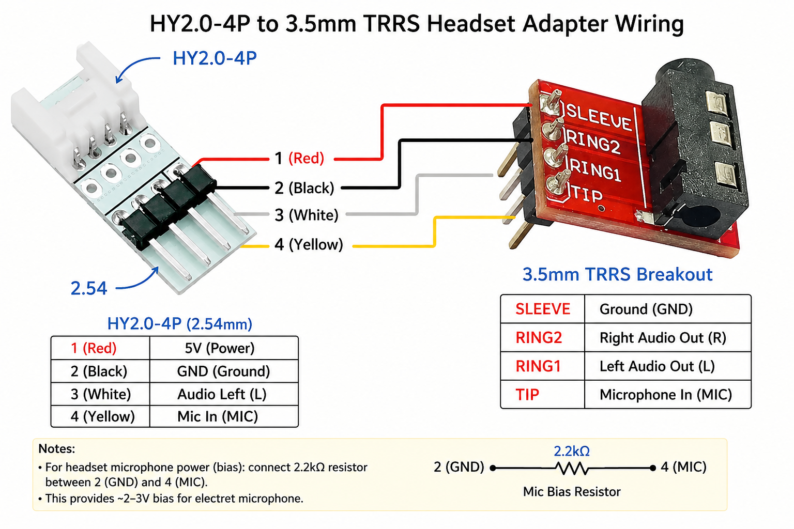
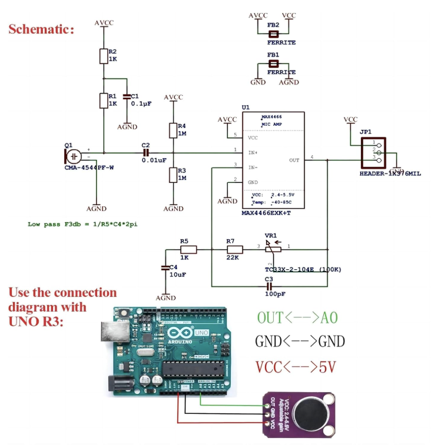

# Core2 Grove Microphone Adapter

The Core2 has a built-in **SPM1423 PDM microphone** used by the `listen` voice command.
This document describes how to connect an **external TRRS headset microphone** via
Grove Port B as an alternative — useful when you need to speak from a distance,
want noise cancellation from a headset, or want to reduce pickup from the nearby speaker.

---

## Hardware required

- **HY2.0-4P to 3.5mm TRRS adapter** (Grove cable with TRRS breakout) —
  see wiring diagram below
- **MAX4466 electret mic amplifier breakout** — amplifies the headset's mic signal
  to a level the ESP32 ADC can use reliably
- **TRRS headset** (CTIA standard: TIP = MIC, RING1 = Left audio,
  RING2 = Right audio, SLEEVE = GND)
- **2.2 kΩ bias resistor** (shown in the adapter diagram) — provides ~1.65 V
  bias for the electret element

---

## Wiring



Connect everything to **Grove Port B** (the black Grove port on the Core2 side):

| Grove Port B pin | Signal | Connect to |
|---|---|---|
| 1 — GND | Ground | MAX4466 GND, TRRS SLEEVE |
| 2 — 3.3 V | Power | MAX4466 VCC |
| 3 — GPIO 26 | *(unused)* | — |
| 4 — GPIO 36 | ADC input | MAX4466 OUT |

GPIO 36 is **ADC1_CH0** — input-only and ADC1-capable, so it is safe to read
while WiFi is active. GPIO 26 is ADC2 and cannot be used while WiFi is running,
which is why it is left unconnected.

### Bias resistor

The 2.2 kΩ resistor in the adapter diagram goes between **3.3 V (pin 2) and the
TRRS TIP pin**. This biases the electret element to approximately VCC/2 = 1.65 V,
which sits comfortably within the ADC's 0–3.3 V measurement range.

### Headset mic connection to MAX4466

The MAX4466 breakout ships with an onboard electret capsule (CMA-4544PF-W).
For a TRRS headset you have two options:

- **Replace the onboard capsule** — remove it and wire the TRRS TIP to the
  IN+ pad and TRRS SLEEVE to AGND. This gives the cleanest signal.
- **Use the adapter as a standalone mic** — leave the onboard capsule in place
  and position the breakout near where you speak, ignoring the TRRS connector.

---

## MAX4466 amplifier



The MAX4466 is a low-noise mic amplifier with adjustable gain (up to ~125×,
set by the onboard potentiometer VR1). Its output is DC-biased at VCC/2
(≈ 1.65 V with 3.3 V supply), so the audio signal rides above 0 V and stays
within the ESP32 ADC's input range with no coupling capacitor needed.

Connect as shown:

| MAX4466 pin | Connect to |
|---|---|
| VCC | Grove Port B pin 2 (3.3 V) |
| GND | Grove Port B pin 1 (GND) |
| OUT | Grove Port B pin 4 (GPIO 36) |

---

## Signal path

```
TRRS headset mic
      │  (electret, ~1–10 mV)
      ▼
MAX4466 (up to 125× gain, adjustable pot)
      │  (AC audio on 1.65 V DC bias)
      ▼
GPIO 36 — ADC1_CH0
      │
      ▼
ESP32 ADC continuous mode
  16 kHz sample rate, 12-bit, 0–3.3 V range
  DMA-backed (core2_adc_mic.c)
      │
      ▼
Post-processing in firmware
  DC subtract (midpoint ≈ 2048 of 4096)
  IIR high-pass filter (removes residual DC + low-frequency rumble)
  8× software gain with saturation
      │
      ▼
16-bit mono WAV @ 16 kHz → Whisper STT
```

The ADC driver ([`main/core2_adc_mic.c`](main/core2_adc_mic.c)) uses the
ESP-IDF ADC continuous-mode API (DMA-backed). It does **not** conflict with
I2S_NUM_1 (speaker / PDM path) or I2S_NUM_0 (internal PDM mic path).

---

## micsrc command

The `micsrc` command switches between the built-in PDM mic and the Grove ADC
mic. The selection is persisted to NVS and survives reboots.

| Command | Effect |
|---|---|
| `micsrc grove` | Switch to the external Grove mic (MAX4466 on GPIO 36) |
| `micsrc pdm` | Switch back to the built-in PDM mic (SPM1423, default) |
| `micsrc` (no param) | Toggle between the two |

The `listen` command and the power-button short-press both use whichever
source is currently active.

---

## Gain adjustment

Turn the potentiometer on the MAX4466 board while issuing a `listen` command
and watching the serial log. You want to see log output like:

```
Post-gain peak=15000, 64000 samples, 128044 B WAV
```

A `peak` value in the range **5000–25000** typically gives good Whisper STT
results. If `peak` is much lower than 5000, turn the pot clockwise to increase
gain. If the audio is clipping (peak = 32767 consistently), turn it back.
