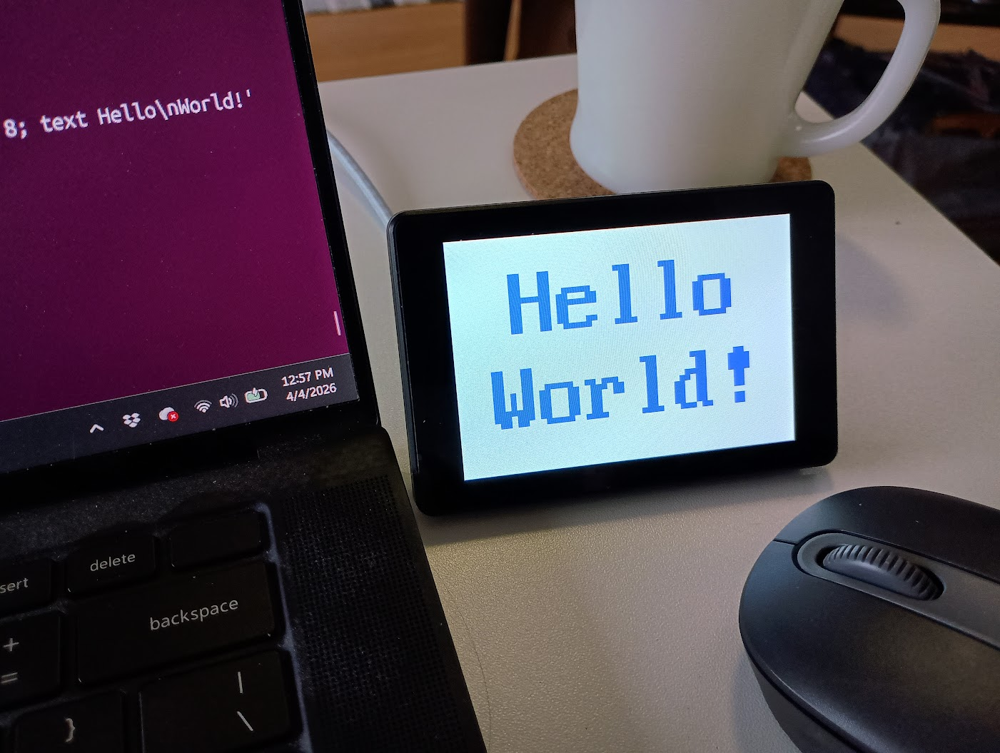

# Guition JC3248W535 — 320×480 Screen via SSH

This variant targets the **Guition JC3248W535** (ESP32-S3, 320×480 AXS15231
QSPI display) and fills the entire screen with a solid color and your text in response to SSH commands.  Allows touch scrolling if you send more text than can fit on the screen.

---

## Shell commands

```
> help

Commands:
  color <name>      Named colour: red green blue white yellow
                    cyan magenta purple orange pink
  color R G B       RGB triplet, each value 0-255
  color #RRGGBB     Hex colour (e.g. #FF8800)
  textcolor <name>  Set text colour (same syntax as color)
  text <message>    Draw text on screen (wraps at word boundaries, \n = newline)
  landscape         Rotate display to landscape (480×320)
  portrait          Rotate display to portrait  (320×480)
  fontsize <1-8>    Set font scale (1=8px … 8=64px per char)
  off               Fill screen black
  status            Show current screen colour
  help              Show this help text
  exit | quit       Close the connection
```

Multiple commands can be chained on one line using `;` as a separator.
The `text` command is **greedy** — it consumes everything after `text ` (including
any `;`), so it must be the last command on a line.

### Examples

```
> color red
Screen set to R:255 G:0   B:0    (#FF0000)

> color 0 128 255
Screen set to R:0   G:128 B:255  (#0080FF)

> color #FF8800
Screen set to R:255 G:136 B:0    (#FF8800)

> textcolor yellow
Text colour set to R:255 G:255 B:0    (#FFFF00)

> text Hello World
Text set.

> text ESP32-S3\nReady
Text set.
(displays two lines: "ESP32-S3" above "Ready")

> text Line1\nLine2\nLine3
Text set.
(displays three lines)

> fontsize 3
Font scale set to 3 (24x48 px per character).

> landscape
Display set to landscape (480x320).

> off
Screen off.

> status
Screen is off (black).
```

### Chained-command examples (`;` separator)

```
> color blue ; textcolor white ; fontsize 2
(sets background blue, text colour white, font scale 2)

> color #1A1A2E ; textcolor #E94560 ; text ESP32-S3\nSSH Screen
(dark navy background, red text, two-line message)

> portrait ; color black ; textcolor cyan ; fontsize 3 ; text Hello\nWorld
(portrait orientation, black bg, cyan text at scale 3, two lines)
```

## Example ssh command

```bash
ssh -i ~/.ssh/id_ed25519 admin@<device-ip> 'landscape; color white; textcolor blue; fontsize 8; text Hello\nWorld!'
```



---

## Boot indicators

The screen itself is used as the boot status indicator:

| Color | Meaning |
|--------|---------|
| Brief blue fill | Wi-Fi provisioning or connecting |
| Brief green fill | Wi-Fi connected, IP obtained |
| Solid red fill | Error (Wi-Fi failed or SSH init failed) — check serial log |

---

## Building this variant

In `menuconfig`, under **"ESP32 SSH LED Configuration"**, select:

> **Hardware variant → Guition JC3248W535 (320×480 AXS15231 QSPI display)**

Then build normally:

```bash
idf.py build
idf.py -p COM<N> flash
```
