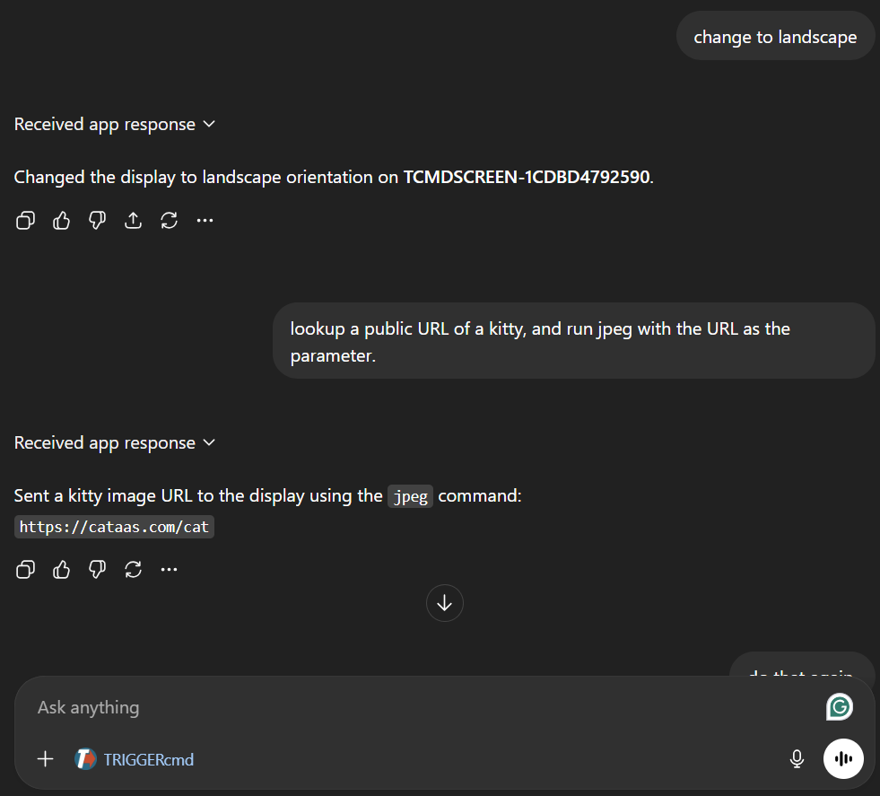
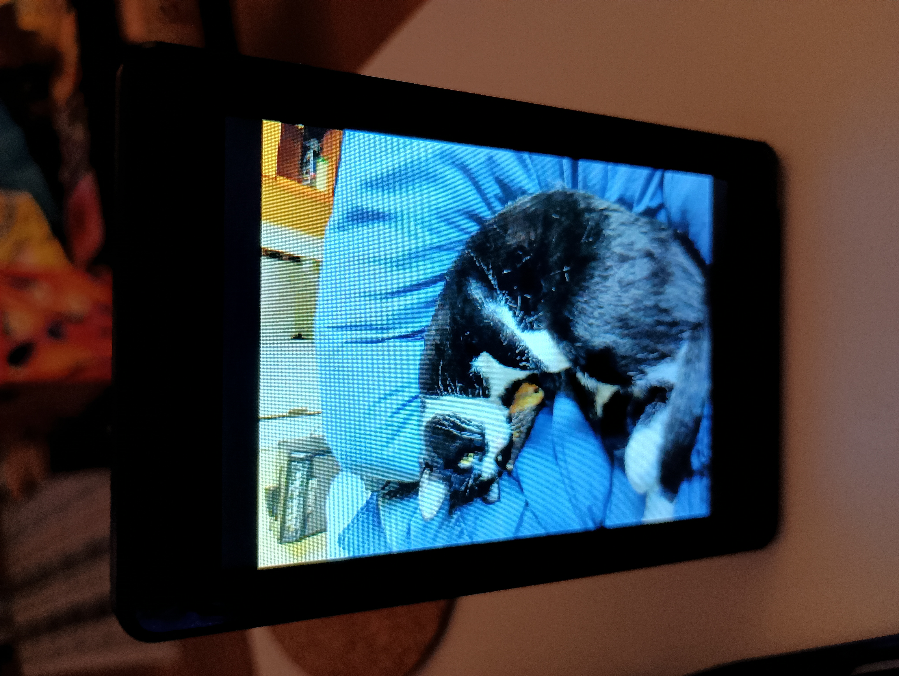

# Picture Frame - TRIGGERcmd Display

This variant targets the **Guition JC3248W535** (ESP32-S3 + 320x480 AXS15231
screen) and works as a cloud-connected **TRIGGERcmd display endpoint**.

It does not use the SSH command shell. Instead, it connects to TRIGGERcmd,
receives commands over Socket.IO, and updates the display in real time.

---

## What it does

1. Initializes the display and connects to Wi-Fi.
2. If needed, starts BLE Improv Wi-Fi provisioning.
3. Pairs to TRIGGERcmd with a pair code flow (`/pair` + `/pair/lookup`).
4. Creates/registers a computer identity (`TCMDSCREEN-<MAC>`).
5. Connects to Socket.IO and subscribes to its TRIGGERcmd room.
6. Executes incoming display commands and reports completion (`/api/run/save`).

---

## Supported TRIGGERcmd commands

| Command | Parameters | Effect |
|---------|------------|--------|
| `text` | message text | Draw wrapped text on screen |
| `color` | named color or hex (`#RRGGBB`) | Set background color |
| `textcolor` | named color or hex (`#RRGGBB`) | Set text color |
| `fontsize` | integer | Set font scale (clamped to 1-4) |
| `landscape` | none | Rotate to 480x320 |
| `portrait` | none | Rotate to 320x480 |
| `jpeg` | image URL | Download/decode/display JPEG |
| `save` | none | Persist current display state to NVS |

### Notes

- JPEG downloads are capped at **512 KB** and decoded to RGB565.
- Last JPEG is cached so orientation changes can redraw without re-downloading.
- The `save` command stores display state (colors, font, orientation, text, JPEG URL)
  in NVS and restores it on reboot.

## Example: sending a kitty photo via ChatGPT

Ask ChatGPT to look up a public cat image and send it to the display using the TRIGGERcmd app:



The Picture Frame receives the `jpeg` command over Socket.IO and immediately downloads and renders the image:



---

## Display states during boot/connect

| State | Screen behavior |
|-------|------------------|
| Waiting for Wi-Fi / provisioning | Status text shown; blue background for BLE provisioning |
| Wi-Fi connected | Brief green status then display off |
| Pairing | Shows host and pair code instructions |
| Connecting to TRIGGERcmd | "Connecting to server..." |
| Ready | "Connected! Waiting for commands..." |

---

## SD card configuration

On boot, the firmware checks for a file named **`config.txt`** in the root of
the SD card.  If the file exists, any credentials it contains are written to
NVS (overwriting previously stored values) before Wi-Fi connects.

This is the easiest way to pre-provision a device without going through the
SoftAP or BLE pairing flow.

### File format

Plain text, one `key=value` pair per line.  Blank lines and lines starting
with `#` are ignored.  All keys are optional — include only what you need.

```
# Wi-Fi networks (up to three)
ssid=MyNetwork
password=mypassword
ssid2=BackupNetwork
password2=backuppass
ssid3=ThirdNetwork
password3=thirdpass

# OpenAI API key (used for voice queries on Core2)
openai_key=sk-proj-...
```

### Notes

- The file is read every boot, so you can update credentials by editing the
  file and rebooting — no re-flashing required.
- If the SD card is absent or `config.txt` does not exist, boot continues
  normally with whatever credentials are already in NVS.
- Values overwrite NVS unconditionally, so removing a key from the file on a
  subsequent boot does **not** clear the previously saved NVS value.

---

## Hardware notes

| Item | Detail |
|------|--------|
| Board | Guition JC3248W535 |
| Display | AXS15231 QSPI TFT, 320x480 |
| Console | USB Serial/JTAG |
| Memory | OPI PSRAM enabled (needed for JPEG buffers) |

---

## Building this variant

In `menuconfig`, under **ESP32 SSH LED Configuration**, select:

> **Hardware variant -> TriggerCMD Picture Frame (JC3248W535 + Socket.IO commands)**

Build with the project script:

```powershell
. C:\esp\v6.0\esp-idf\export.ps1 2>&1 | Out-Null ; .\build.ps1 -Variant picture_frame
```

Output firmware path:

- `docs/firmware/esp32_picture_frame.bin`

---

## Related files

- `main/picture_frame.c` - main firmware flow for this variant
- `sdkconfig.picture_frame` - variant configuration
- `docs/manifest-picture_frame.json` - browser installer manifest

---

## Core2 for AWS variant

The same TRIGGERcmd picture-frame firmware also runs on the
**M5Stack Core2 for AWS** (classic ESP32, ILI9342C 320×240 SPI display). The
core display commands above are identical, but the Core2's extra hardware
(PSRAM, battery, Bluetooth, microphone, speaker, LED bar) adds a much larger
command set — Bluetooth MP3 playback, a 100-style LED music visualizer, an AI
voice assistant, and battery/power management.

See [Core2 TRIGGERcmd Display](Core2-TRIGGERcmd-Display.md) for the full
feature list, build instructions, and hardware notes.
